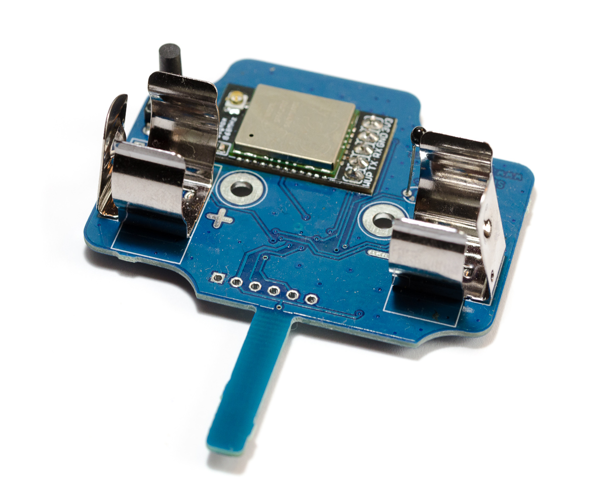
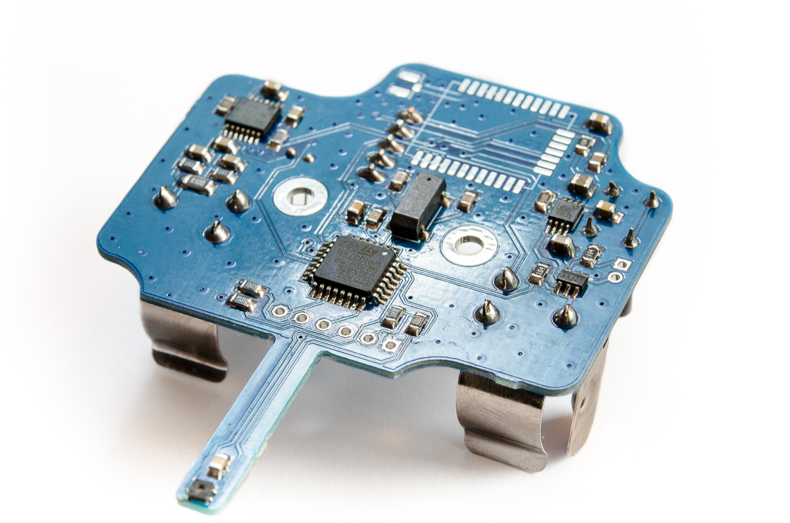
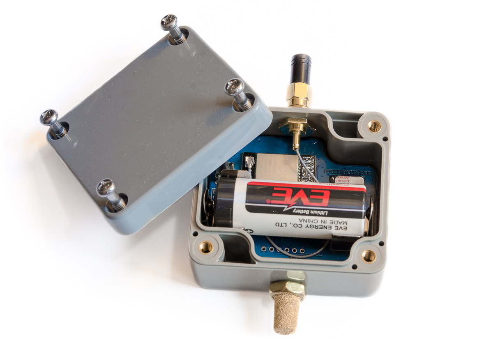
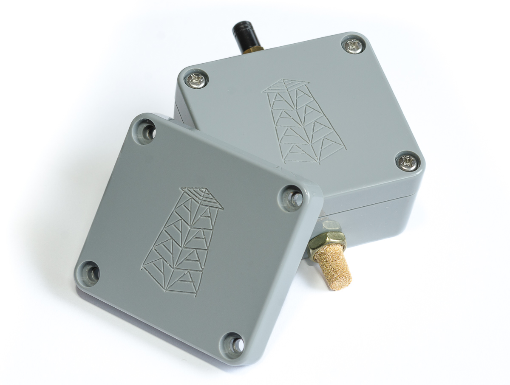

# Sigfox temperature & humidity sensor

[](https://github.com/pilotak/sigfox-th-sensor/actions)
[](https://os.mbed.com/)

<p float="left">
  
   
</p>

<p float="left">
  
   
</p>

## Calibration

Below you can find details how to calibrate the battery gauge

<details>
<summary>Basic calibration</summary>

Run following code in order to prepare & calibrate the battery gauge. Apply precisely 3.6V to battery clips. _(or adjust this values below)_.

> **Really important** to power the board via programming header during calibration (no current can flow through battery).
> Be careful! the board runs at +2V5 so the programmer has to have a same voltage levels or the regulator must not be populated when powering/programming at +3V3.

```cpp
#include "mbed.h"
#include "BQ35100.h"
#include "SHTC3.h"

I2C i2c(I2C_SDA, I2C_SCL);
BQ35100 gauge(GAUGE_ENABLE_PIN);
SHTC3 sht;

int main() {
    if (sht.init(&i2c)) {
        debug("SHTC3 init OK\n");

    } else {
        debug("SHTC3 init failed\n");
        return 0;
    }

    uint16_t real_temp;

    if (sht.read(&real_temp, nullptr)) {
        float temp = sht.toCelsius(real_temp) * 100;
        temp += 27315; // to 0.01 Kelvin
        temp /= 10; // to 0.1 Kelvin

        real_temp = (uint16_t)temp;

        debug("SHTC3 temperature: %uK\n", real_temp);

    } else {
        debug("SHTC3 temperature read failed\n");
        return 0;
    }

    if (gauge.init(&i2c)) {
        debug("Init OK\n");

    } else {
        debug("Could not init the gauge\n");
        return 0;
    }

    if (gauge.setSecurityMode(BQ35100::SECURITY_UNSEALED)) {
        debug("Device unsealed\n");

    } else {
        debug("Unseal failed\n");
        return 0;
    }

    ThisThread::sleep_for(1s);

    if (gauge.setGaugeMode(BQ35100::ACCUMULATOR_MODE)) {
        debug("Gauge mode set\n");

    } else {
        debug("Set gauge mode failed\n");
        return 0;
    }

    ThisThread::sleep_for(1s);

    if (gauge.setDesignCapacity(3800)) {
        debug("Design capacity set\n");

    } else {
        debug("Design capacity set failed\n");
        return 0;
    }

    ThisThread::sleep_for(1s);

    if (gauge.setBatteryAlert(0)) { // no alerts
        debug("Alerts cleared\n");

    } else {
        debug("Alert clear failed\n");
        return 0;
    }

    ThisThread::sleep_for(1s);

    if (gauge.startGauge()) {
        debug("Gauge started\n");

    } else {
        debug("Could not start the gauge\n");
        return 0;
    }

    ThisThread::sleep_for(1s);

    if (gauge.calibrateVoltage(3600)) { // mV
        debug("Voltage calibration successful\n");

    } else {
        debug("Voltage calibration failed\n");
        return 0;
    }

    ThisThread::sleep_for(1s);

    if (gauge.performCCOffset()) {
        debug("CC offset successful\n");

    } else {
        debug("CC offset failed\n");
        return 0;
    }

    ThisThread::sleep_for(1s);

    if (gauge.performBoardOffset()) {
        debug("Board offset successful\n");

    } else {
        debug("Board offset failed\n");
        return 0;
    }

    ThisThread::sleep_for(1s);

    if (gauge.useInternalTemp(true) && gauge.calibrateTemperature(real_temp)) {
        debug("Internal temperature calibration successful\n");

    } else {
        debug("Internal temperature calibration failed\n");
        return 0;
    }

    ThisThread::sleep_for(1s);

    if (gauge.useInternalTemp(false) && gauge.calibrateTemperature(real_temp)) {
        debug("External temperature calibration successful\n");

    } else {
        debug("External temperature calibration failed\n");
        return 0;
    }

    debug("Done\n");

    gauge.setSecurityMode(BQ35100::SECURITY_SEALED);
}
```

</details>

<details>
<summary>Current calibration</summary>

Run following code in order to calibrate flow current for battery gauge. Apply 100mA load _(or adjust this values below)_ between "battery +" and GND (**not** battery -)

```cpp
#include "mbed.h"
#include "BQ35100.h"

BQ35100 gauge(GAUGE_ENABLE_PIN);
I2C i2c(I2C_SDA, I2C_SCL);

int main() {
    if (gauge.init(&i2c)) {
        debug("Init OK\n");

    } else {
        debug("Could not init the gauge\n");
        return 0;
    }

    ThisThread::sleep_for(5s);

    if (gauge.setSecurityMode(BQ35100::SECURITY_UNSEALED)) {
        debug("Device unsealed\n");

    } else {
        debug("Unseal failed\n");
        return 0;
    }

    ThisThread::sleep_for(1s);

    if (gauge.setGaugeMode(BQ35100::ACCUMULATOR_MODE)) {
        debug("Gauge mode set\n");

    } else {
        debug("Set gauge mode failed\n");
        return 0;
    }

    ThisThread::sleep_for(1s);

    if (gauge.startGauge()) {
        debug("Gauge started\n");

    } else {
        debug("Could not start the gauge\n");
        return 0;
    }

    debug("Apply 100mA current within next 10s\n");

    ThisThread::sleep_for(10s);

    if (gauge.calibrateCurrent(100)) { // mA
        debug("Current calibration successful\n");

    } else {
        debug("Current calibration failed\n");
        return 0;
    }

    debug("Done\n");

    gauge.setSecurityMode(BQ35100::SECURITY_SEALED);
}
```

</details>

## Output example

<details>
<summary>Output data to serial console</summary>

```cpp
#include "mbed.h"
#include "SHTC3.h"
#include "BQ35100.h"

I2C i2c(I2C_SDA, I2C_SCL);
BQ35100 gauge(GAUGE_ENABLE_PIN);
SHTC3 sht;
Wisol wisol(WISOL_TX, WISOL_RX);

int main() {
    if (gauge.init(&i2c)) {
        debug("Gauge nit OK\n");

    } else {
        debug("Could not init the gauge\n");
        return 0;
    }

    if (gauge.startGauge()) {
        debug("Gauge started\n");

    } else {
        debug("Could not start the gauge\n");
        return 0;
    }

    if (sht.init(&i2c)) {
        debug("SHTC3 init OK\n");

    } else {
        debug("SHTC3 init failed\n");
        return 0;
    }

    if (!wisol.init()) {
        debug("Wisol init failed\n");
        return 0;
    }

    uint8_t data[8];

    if (wisol.getId(data)) {
        debug("Wisol ID: %02X%02X%02X%02X\n", data[0], data[1], data[2], data[3]);
    }

    if (wisol.getPac(data)) {
        debug("Wisol PAC: %02X%02X%02X%02X%02X%02X%02X%02X\n", data[0], data[1], data[2], data[3], data[4], data[5], data[6], data[7]);
    }

    while (1) {
        uint16_t data_1, data_2;
        int16_t current;

        if (sht.read(&data_1, &data_2)) {
            float temp = sht.toCelsius(data_1) * 100;
            float humidity = sht.toPercentage(data_2) * 100;

            // result is actually "°C * 100" and "% * 100"
            debug("Temperature: %i*C\nHumidity: %u%%\n", (int16_t)temp, (uint16_t)humidity);

        } else {
            debug("SHTC3 read failed\n");
        }

        if (gauge.getVoltage(&data_1)) {
            debug("Battery voltage: %umV\n", data_1);

        } else {
            debug("Failed to read battery voltage\n");
        }

        if (gauge.getCurrent(&current)) {
            debug("Battery current: %imA\n", current);

        } else {
            debug("Failed to read battery current\n");
        }

        if (gauge.getTemperature(&data_1)) {
            // result is actually "°C * 100"
            debug("Battery temperature: %li*C\n", ((int32_t)data_1 * 10) - 27315);

        } else {
            debug("Failed to read battery temperature\n");
        }

        if (gauge.getInternalTemperature(&data_1)) {
            // result is actually "°C * 100"
            debug("Gauge temperature: %li*C\n", ((int32_t)data_1 * 10) - 27315);

        } else {
            debug("Failed to read gauge temperature\n");
        }

        debug("\n");

        ThisThread::sleep_for(2s);
    }
}
```

</details>
