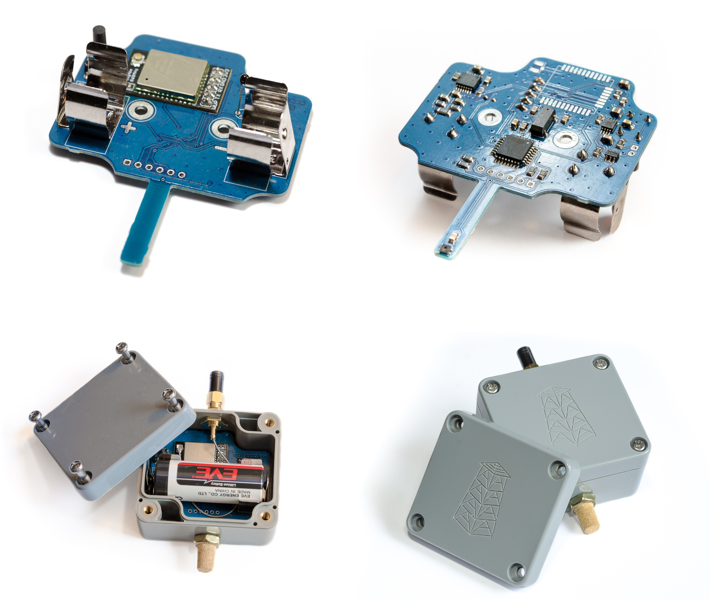

# Sigfox temperature & humidity sensor

Outdoor battery powered temperature & humidity IOT sensor with integrated Sigfox transceiver and battery state monitor.

All data are sent to Sigfox backend, in order to save them to ie.: InfluxDB you can use  [Sigfox to InfluxDB convertor](https://github.com/pilotak/docker-sigfox-influxdb).

For more information please visit [wiki](./wiki)